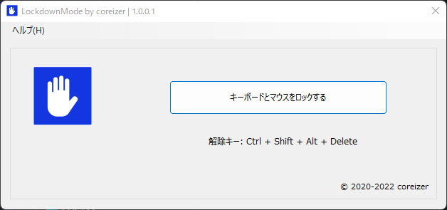

# LockdownMode

LockdownModeはマウスやキーボード類のデバイスを一時的に無効化する機能を提供します。

## 使用方法
 1. LockdownMode.exe を起動します
 2. キーボードとマウスをロックする
 
## 解除方法
 1. キーボードのキー「Ctrl」+「Shift」+「Delete」

## 機能
- キーボードの入力阻止
- マウスのカーソルを真ん中に固定する

## スクリーンショット

## 連絡
- [Website (coreizer.dev)](https://www.coreizer.dev)
- [Twitter](https://www.twitter.com/coreizer)

## 作成者
coreizer

### ライセンス
[GPL v3 licensed.](LICENSE)
